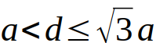
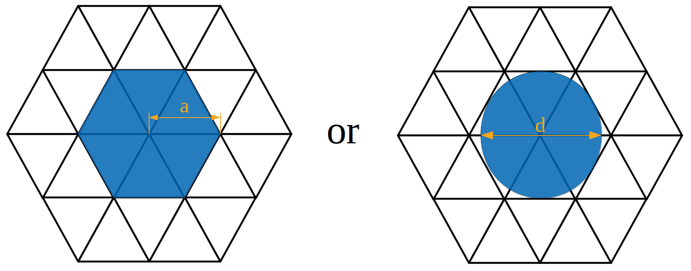

# Baxter's exact solution for hard hexagon model
The Python implementation of an exact solution for the hard hexagon model, proposed by Baxter in 1980. It is a 2D lattice model of a gas, where particles are allowed to be on the vertices of a triangular lattice but no two particles may be adjacent.

## Description

A schematic representation of the model is shown in the figure. Alternatively, the model can be formulated as a model of hard disks of size  on a triangular lattice, where <i>d</i> is a hard disk diameter and <i>a</i> is a lattice spacing.

The hard hexagon model occurs within the framework of the grand canonical ensemble, where the total number of particles (the "hexagons") is allowed to vary naturally, and is fixed by a chemical potential. In the hard hexagon model, all valid states have zero energy, and so the only important thermodynamic control variable is the ratio of chemical potential to temperature <i>µ/(kT)</i>. The exponential of this ratio, <i>z = exp(µ/(kT))</i> is called the activity and larger values correspond roughly to denser configurations.

For a triangular lattice with N sites, the grand partition function is 

