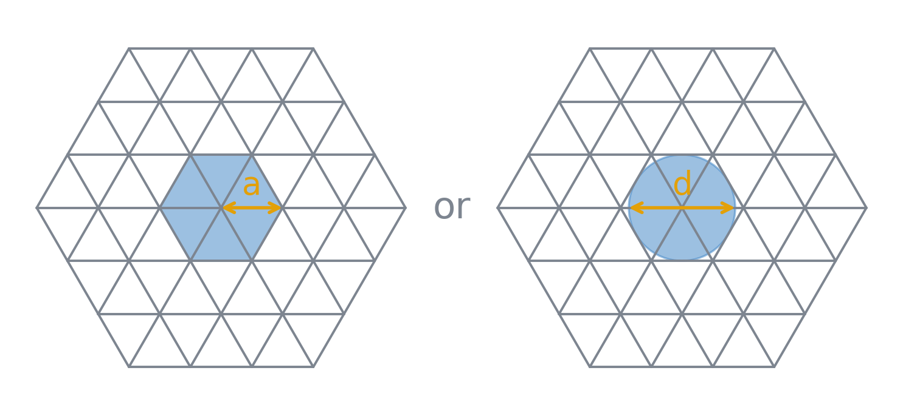
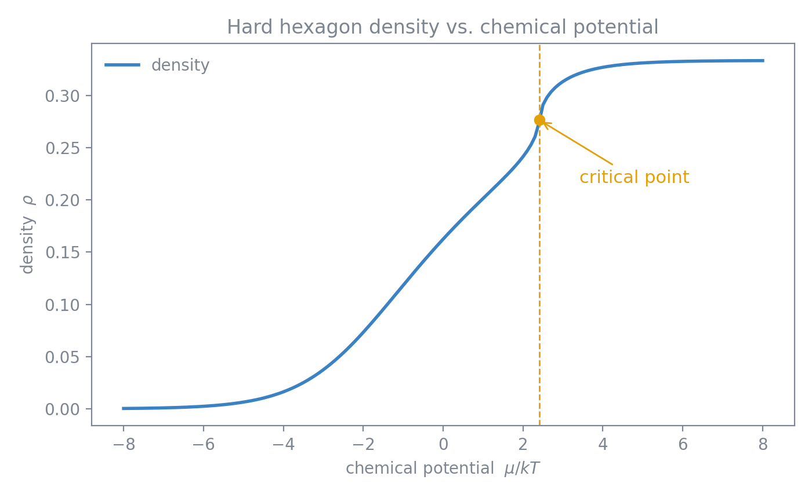

# Baxter's exact solution for hard hexagon model

The Python implementation of an exact solution for the hard hexagon model, proposed by Baxter in 1980. It is a 2D lattice model of a gas, where particles are allowed to be on the vertices of a triangular lattice but no two particles may be adjacent.

## Description

A schematic representation of the model is shown in the figure. Alternatively, the model can be formulated as a model of hard disks of size $a < d \le \sqrt{3}\,a$ on a triangular lattice, where <i>d</i> is a hard disk diameter and <i>a</i> is a lattice spacing.

<p align="center"></p>

The hard hexagon model occurs within the framework of the grand canonical ensemble, where the total number of particles (the "hexagons") is allowed to vary naturally, and is fixed by a chemical potential. In the hard hexagon model, all valid states have zero energy, and so the only important thermodynamic control variable is the ratio of chemical potential to temperature <i>mu/(kT)</i>. The exponential of this ratio, <i>z = exp(mu/(kT))</i> is called the activity and larger values correspond roughly to denser configurations.

For a triangular lattice with N sites, the grand partition function is

$$\mathcal{Z}(z) = \sum_n z^n\, g(n, N) = 1 + Nz + \frac{1}{2} N(N - 7) z^2 + \cdots$$

where g(n, N) is the number of ways of placing n particles on distinct lattice sites such that no 2 are adjacent. The function kappa is defined by

$$\kappa(z) = \lim_{N \to \infty} \mathcal{Z}(z)^{1/N} = 1 + z - 3z^2 + \cdots$$

so that log(kappa) is the free energy per unit site. Solving the hard hexagon model means (roughly) finding an exact expression for kappa as a function of z.

## Solution

The solution is different for the areas before and after the critical point. For <i>z</i> less than critical:

$$z = \frac{-x\, H(x)^5}{G(x)^5}$$

$$\kappa = \frac{H(x)^3 Q(x^5)^2}{G(x)^2} \prod_{n \ge 1} \frac{(1 - x^{6n-4})(1 - x^{6n-3})^2 (1 - x^{6n-2})}{(1 - x^{6n-5})(1 - x^{6n-1})(1 - x^{6n})^2}$$

$$\rho = \rho_1 = \rho_2 = \rho_3 = \frac{-x\, G(x) H(x^6) P(x^3)}{P(x)}$$

For <i>z</i> more than critical the solution is given by:

$$z = \frac{G(x)^5}{x\, H(x)^5}$$

$$\kappa = x^{-1/3} \frac{G(x)^3 Q(x^5)^2}{H(x)^2} \prod_{n \ge 1} \frac{(1 - x^{3n-2})(1 - x^{3n-1})}{(1 - x^{3n})^2}$$

$$\rho_1 = \frac{H(x) Q(x) \left( G(x) Q(x) + x^2 H(x^9) Q(x^9) \right)}{Q(x^3)^2}$$

$$\rho_2 = \rho_3 = \frac{x^2 H(x) Q(x) H(x^9) Q(x^9)}{Q(x^3)^2}$$

where

$$G(x) = \prod_{n \ge 1} \frac{1}{(1 - x^{5n-4})(1 - x^{5n-1})}$$

$$H(x) = \prod_{n \ge 1} \frac{1}{(1 - x^{5n-3})(1 - x^{5n-2})}$$

$$P(x) = \prod_{n \ge 1} (1 - x^{2n-1}) = Q(x) / Q(x^2)$$

$$Q(x) = \prod_{n \ge 1} (1 - x^{n})$$

## Installation

The exact solution lives in the dependency-free `hardhexagon` package. Install the latest version straight from GitHub:

```bash
pip install git+https://github.com/IakOBiaN/hard-hexagon.git
```

Or clone the repository and install it in editable mode:

```bash
git clone https://github.com/IakOBiaN/hard-hexagon.git
cd hard-hexagon
pip install -e .
```

The core package needs only the Python standard library. Two optional extras are available: `plot` (adds matplotlib for `plot_solution.py`) and `dev` (adds pytest for the test suite) — for example, `pip install -e ".[plot,dev]"`.

## Python usage

The formulas are parameterized by Baxter's internal parameter `x`, while the physically convenient input is the chemical potential `mu`. The project exposes `solve_by_mu(mu)`, which finds the matching `x` numerically and returns the thermodynamic quantities:

```python
import hardhexagon as hardhex

solution = hardhex.solve_by_mu(2.437)
print(solution.density)      # 0.2839413924102479
print(solution.activity)     # 11.438673197659805  (z = exp(mu))
print(solution.free_energy)  # -0.8478466096725723  (free energy per site)
print(solution.parameter)    # 0.2617812843639773  (Baxter's internal x)
print(solution.phase)        # high_activity
```

`Solution` is a dataclass, so you can also print the whole record at once:

```python
print(solution)
# Solution(chemical_potential=2.437, activity=11.438673197659805,
#          free_energy=-0.8478466096725723, density=0.2839413924102479,
#          parameter=0.2617812843639773, phase='high_activity')
```

The exact location of the phase transition is precomputed and exposed as read-only constants — you read them, you do not set them. They are convenient for comparing your own runs against the known critical point:

```python
print(hardhex.CRITICAL_ACTIVITY)            # 11.090169943749475  = (11 + 5*sqrt(5)) / 2
print(hardhex.CRITICAL_CHEMICAL_POTENTIAL)  # 2.4060591252980172  = log(CRITICAL_ACTIVITY)
```

## Plotting

The repository ships `plot_solution.py`, which sweeps the chemical potential over the default grid, plots the density, and marks the critical point:

```python
import matplotlib.pyplot as plt
import hardhexagon as hardhex

solutions = hardhex.get_solution()
chemical_potential = [solution.chemical_potential for solution in solutions]
density = [solution.density for solution in solutions]

critical_mu = hardhex.CRITICAL_CHEMICAL_POTENTIAL
critical_density = hardhex.solve_by_mu(critical_mu).density

plt.plot(chemical_potential, density, label="density")
plt.axvline(critical_mu, color="orange", linestyle="--")
plt.plot(critical_mu, critical_density, "o", color="orange", label="critical point")
plt.xlabel("chemical potential  $\\mu / kT$")
plt.ylabel("density  $\\rho$")
plt.legend()
plt.show()
```

The density rises from the dilute gas towards the close-packed value of 1/3, with the order/disorder transition at the marked critical point:

<p align="center"></p>
