# Baxter's exact solution for hard hexagon model

The Python implementation of an exact solution for the hard hexagon model, proposed by Baxter in 1980. It is a 2D lattice model of a gas, where particles are allowed to be on the vertices of a triangular lattice but no two particles may be adjacent.

## Description

A schematic representation of the model is shown in the figure. Alternatively, the model can be formulated as a model of hard disks of size 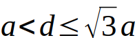 on a triangular lattice, where <i>d</i> is a hard disk diameter and <i>a</i> is a lattice spacing.

<p align="center"></p>

The hard hexagon model occurs within the framework of the grand canonical ensemble, where the total number of particles (the "hexagons") is allowed to vary naturally, and is fixed by a chemical potential. In the hard hexagon model, all valid states have zero energy, and so the only important thermodynamic control variable is the ratio of chemical potential to temperature <i>mu/(kT)</i>. The exponential of this ratio, <i>z = exp(mu/(kT))</i> is called the activity and larger values correspond roughly to denser configurations.

For a triangular lattice with N sites, the grand partition function is

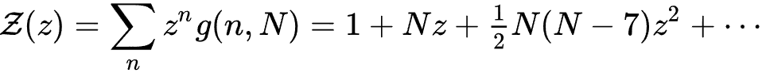

where g(n, N) is the number of ways of placing n particles on distinct lattice sites such that no 2 are adjacent. The function kappa is defined by

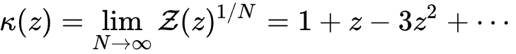

so that log(kappa) is the free energy per unit site. Solving the hard hexagon model means (roughly) finding an exact expression for kappa as a function of z.

## Solution

The solution is different for the areas before and after the critical point. For <i>z</i> less than critical:

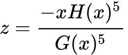
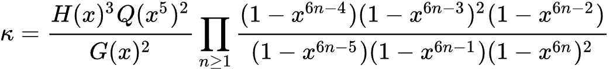
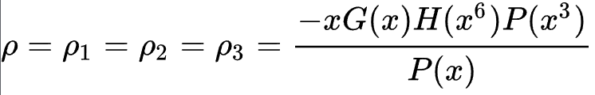

For <i>z</i> more than critical the solution is given by:

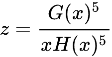
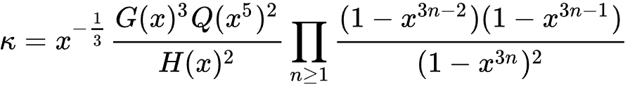
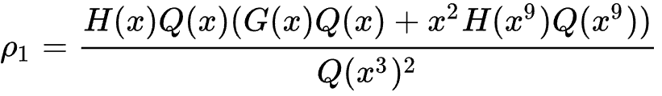
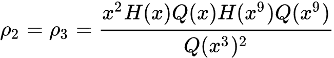

where

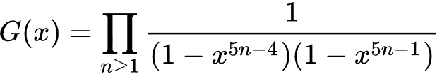
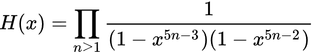
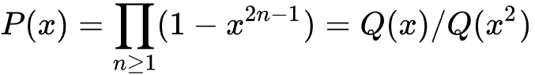
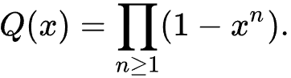

## Python usage

The formulas are parameterized by Baxter's internal parameter `x`, while the physically convenient input is the chemical potential `mu`. The project exposes `solve_by_mu(mu)`, which finds the matching `x` numerically and returns the thermodynamic quantities:

```python
import functions as hardhex

solution = hardhex.solve_by_mu(2.437)
print(solution.activity)
print(solution.free_energy)
print(solution.density)
print(solution.parameter)  # Baxter's internal x parameter
print(solution.phase)
```

The critical activity and chemical potential are available as constants:

```python
hardhex.CRITICAL_ACTIVITY
hardhex.CRITICAL_CHEMICAL_POTENTIAL
```
